<picture><source media="(prefers-color-scheme: dark)" srcset="./assets/hero-dark.svg"></picture>

Computer Engineering student in Mumbai, cooking up agent tooling, CLIs and terminal interfaces &mdash; then publishing them so other people can actually run them.

<samp>
<a href="https://github.com/asterxsk?tab=repositories">repos</a> &nbsp;&middot;&nbsp;
<a href="https://github.com/asterxsk/kiln">kiln</a> &nbsp;&middot;&nbsp;
<a href="https://github.com/asterxsk/ternitor">ternitor</a> &nbsp;&middot;&nbsp;
<a href="https://github.com/asterxsk/clank">clank</a> &nbsp;&middot;&nbsp;
<a href="https://github.com/asterxsk/sonder">sonder</a> &nbsp;&middot;&nbsp;
<a href="https://cnodes.vercel.app">campusnodes&nbsp;&#8599;</a>
</samp>

---

## Now

- **Building** &mdash; [`kiln`](https://github.com/asterxsk/kiln), a versioned configuration layer for the `pi` coding agent. Extensions, defaults, keybindings, and one idempotent installer that is safe to re-run.
- **Deciding** &mdash; whether `sonder`'s access-gate policy belongs behind an interface, so the blackjack hand becomes one implementation among several instead of the only one.
- **Known broken** &mdash; `arete`, my first large TypeScript codebase, is deprecated and superseded by `kiln`. Its README is still indexed. Ignore it.
- **Reading** &mdash; BitTorrent piece-selection strategy, because `tordln` needed a patched `librqbit` to expose it.

---

---

## Stack

The first table is where I've actually shipped code. The second is everything else I'm competent in &mdash; an honest split, because a wall of fifty badges tells you nothing about which of them I've debugged at 2am.

| | |
|:--|:--|
| **Languages** | TypeScript &middot; JavaScript &middot; Go &middot; Rust &middot; Dart &middot; Python &middot; Kotlin &middot; HTML5 &middot; CSS3 &middot; Bash &middot; PowerShell |
| **Frontend** | React 19 &middot; Vite &middot; Tailwind &middot; react-three-fiber &middot; GSAP &middot; Framer Motion &middot; Node.js |
| **Mobile** | Flutter &middot; Android (Kotlin, Accessibility Service, overlays) |
| **Terminal** | Bubble Tea &middot; lipgloss &middot; ratatui &middot; crossterm &middot; tokio |
| **Data** | Supabase (Postgres) &middot; SQL &middot; Docker |
| **Tooling** | Git &middot; GitHub Actions &middot; Vercel &middot; npm &middot; uv |
| **Agents** | `pi` extensions &middot; MCP &middot; prompt and tool design |

### Also in the toolkit &mdash; nothing shipped yet

| | |
|:--|:--|
| **Languages** | C &middot; C++ &middot; Objective-C &middot; PHP |
| **Data & science** | pandas &middot; NumPy &middot; Matplotlib |
| **Graphics & game** | OpenGL &middot; Unity &middot; Unreal Engine &middot; NVIDIA &middot; AMD |
| **Databases** | MySQL |
| **Cloud & infra** | Google Cloud &middot; Apache |
| **Design** | Figma &middot; Canva &middot; Photoshop &middot; Illustrator &middot; Lightroom &middot; Lightroom Classic &middot; Premiere Pro &middot; After Effects &middot; Acrobat Reader |
| **Environment** | Windows Terminal &middot; Raspberry Pi &middot; Tampermonkey &middot; Notion &middot; Markdown &middot; LaTeX |
| **Platforms** | Steam &middot; Epic Games &middot; Xbox &middot; PlayStation Network &middot; Battle.net &middot; Riot Games &middot; Ubisoft &middot; EA &middot; Square Enix &middot; itch.io &middot; Meta |

---

Mumbai &middot; open to internships and open-source work &middot; the fastest way to reach me is a GitHub issue

